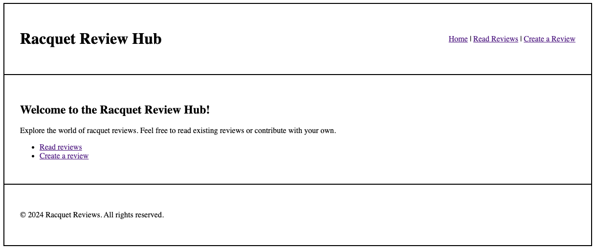
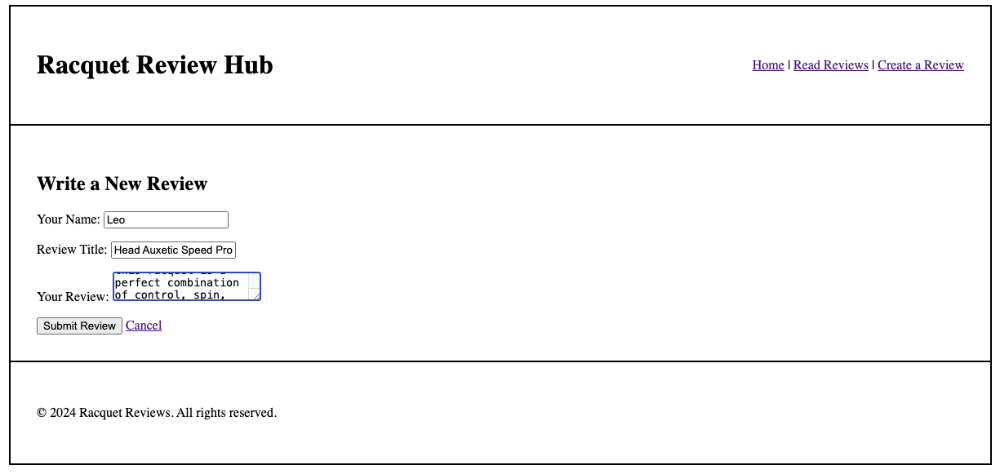
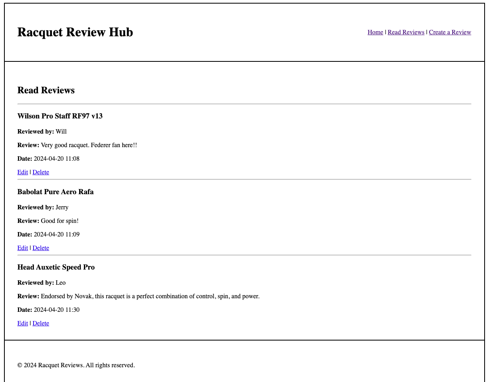
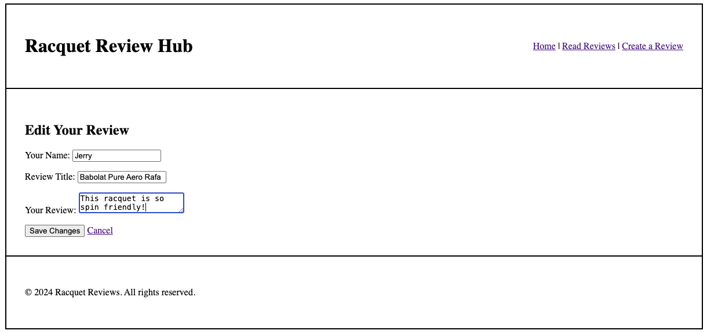
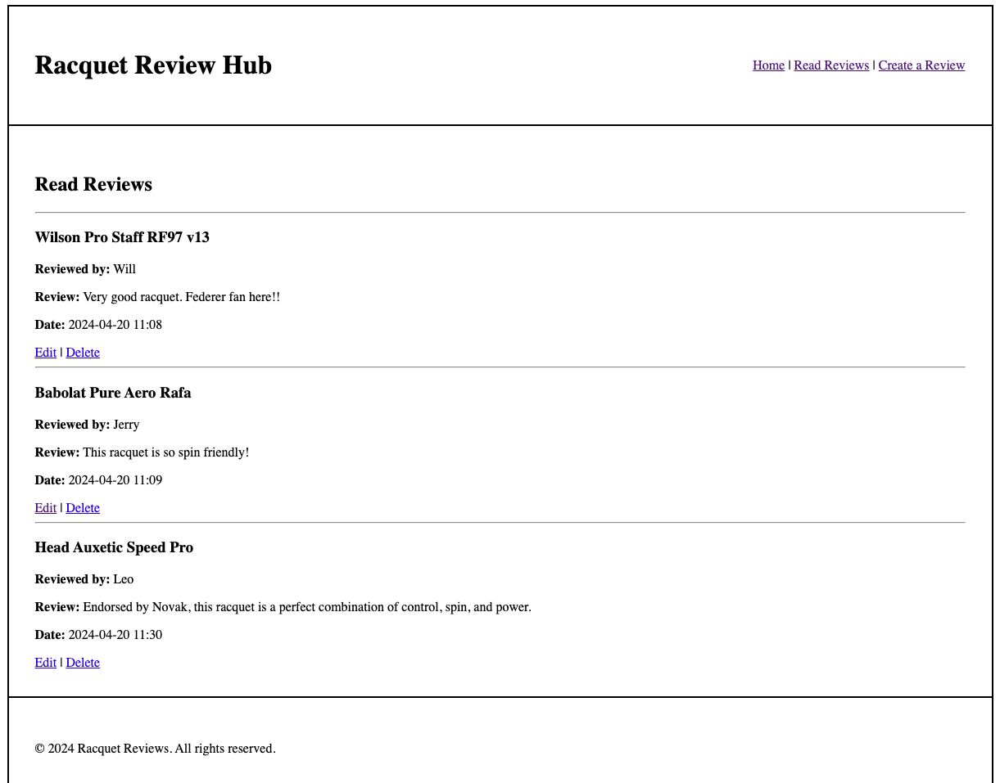
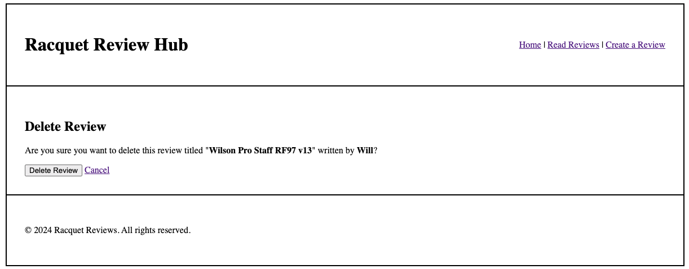
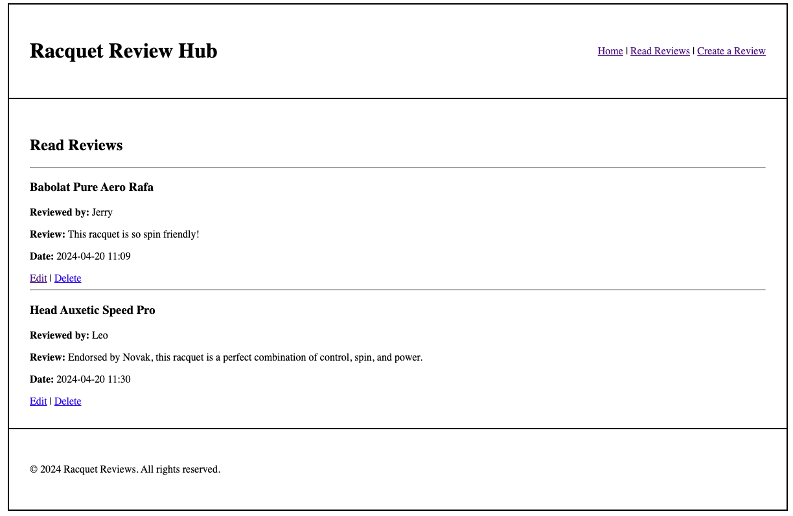
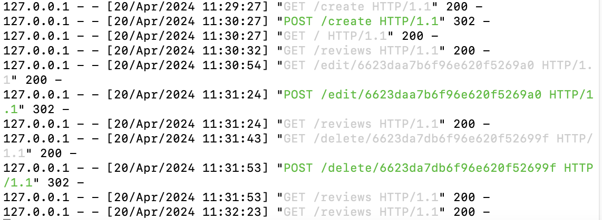

# Racquet Review Hub

## Description

This web app allows tennis enthusiasts to share their reviews of different tennis racquets. Some key features are: 

1. **Read**: This function allows users to read all current reviews on the platform. 
2. **Create**: This function allows users to create a new review of a tennis racqeuet. 
3. **Edit**: This function allows users to edit current reviews.  
4. **Delete**: This function allows users to delete current reviews. 

## Records of Local Running

Since I used MongoDB Atlas to run this web app locally, I had troubles deploying it to the i6 server. However, following are the records that show my successful local running of the web app. 

First we have the home page with the name of the web app **Racquet Review Hub**. The `Read reviews` link performs the **Read** task of the web app, and the `Create a review` link performs the **Create** task. 

After clicking `Create a review`, users can write their name, title, and review of a racquet in this page. In the following image, Leo is writing a review of the Head Auxetic Speed Pro. When he finishes, he could click `Submit Review` to submit or `Cancel` to cancel. 

Leo chose to submit. This would lead us to the page that contains all current and previous reviews. For each review, there is an `Edit` link that performs the **Edit** task and a `Delete` link that performs the **Delete** task. 

Assume that Jerry wants to edit his review of the Babolat Pure Aero Rafa. He clicked the `Edit` link that led him to the following page. In this page, he edited his review from "Good for spin!" to "This racquet is so spin friendly!!" and clicked `Save Changes`.

The action by Jerry results in an updated version of his review, as shown in the page of all current and previous reviews:

Now assume that Will wants to delete his review of the Wilson Pro Staff RF97 v13, he would click the `Delete` link. The website would confirm this action with Will. Assume that Will confirmed and clicked the `Delete Review` button as shown in the image below. 

Will's review is now deleted, and the **Read Reviews** page now only has two reviews remaining. 

Following enclosed is a screenshot of tht terminal that records all the previous actions in the web app. 

